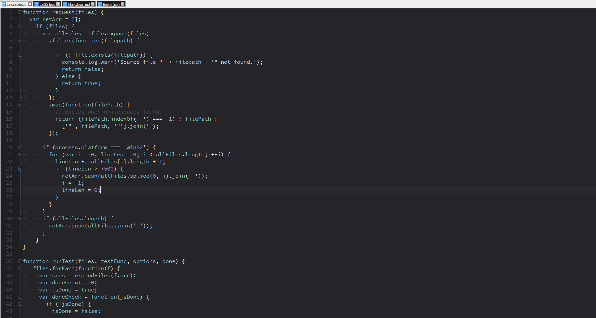

Northem Dark - Notepad++ Syntax
===============================

### Description
A north-bluish dark theme based on the same named color palette [Northem Dark](https://github.com/arcticicestudio/northem-dark).  
This is a darker and more blue-tinged variation of the [Northem](https://github.com/arcticicestudio/northem) color palette.

### Variations
  - <a href="https://github.com/arcticicestudio/northem-notepadplusplus-syntax"> Northem - Notepad++ Syntax</a> 
  - <a href="https://github.com/arcticicestudio/northem-light-notepadplusplus-syntax"> Northem Light - Notepad++ Syntax</a> 

### Other Projects
  - <a href="https://github.com/arcticicestudio/northem-dark-atom-ui">  Northem Dark - IntelliJ IDEA Syntax</a>   
  - <a href="https://github.com/arcticicestudio/northem-dark-atom-syntax"> Northem Dark - Atom Syntax</a>   
  - <a href="https://github.com/arcticicestudio/northem-dark-eclipse-syntax"> Northem Dark - Eclipse Syntax</a>   
  - <a href="https://github.com/arcticicestudio/northem-dark-gedit"> Northem Dark - Gedit Syntax</a> 
  - <a href="#"> Northem Dark - GTK</a> (in drafting) 

Visit the [official website](http://arcticicestudio.com/northem) (currently under construction) for more information.

### Language Support
  -  <a href="http://notepad-plus.sourceforge.net/commun/userDefinedLang/userDefineLang_winbatch.xml">WinBatch</a>
  -  <a href="https://github.com/notepad-plus-plus/notepad-plus-plus/blob/master/PowerEditor/installer/APIs/css.xml">CSS</a>
  - [diff](#)
  -  <a href="https://github.com/notepad-plus-plus/notepad-plus-plus/blob/master/PowerEditor/installer/APIs/html.xml">HTML</a>
  - [Configurations/Properties](#)
  -  <a href="https://github.com/notepad-plus-plus/notepad-plus-plus/blob/master/PowerEditor/installer/APIs/java.xml">Java</a>
  -  <a href="https://github.com/notepad-plus-plus/notepad-plus-plus/blob/master/PowerEditor/installer/APIs/javascript.xml">JavaScript</a>
  -  <a href="https://github.com/notepad-plus-plus/notepad-plus-plus/blob/master/PowerEditor/installer/APIs/php.xml">PHP</a>
  - [SQL](https://github.com/notepad-plus-plus/notepad-plus-plus/blob/master/PowerEditor/installer/APIs/sql.xml)
  -  <a href="#">Shell</a>
  -  <a href="https://github.com/notepad-plus-plus/notepad-plus-plus/blob/master/PowerEditor/installer/APIs/xml.xml">XML</a>

### Version
[`0.0.0`](https://github.com/arcticicestudio/northem-dark-notepadplusplus-syntax/releases/latest)  

For older versions check out the [GitHub Repository](https://github.com/arcticicestudio/northem-dark-notepadplusplus-syntax) or [official website](http://arcticicestudio.com/northem) (currently under construction).

### Changelog
[`0.0.0`](CHANGELOG.md)

### Installation
Download and install the recommended font, read the [Recommendations](#Recommendations) section for more information.

Go to *Edit* > *Settings* > *Style Configurator* > *Import* > *Import Theme(s)*.  
Alternatively copy the theme file manually, depending on the desired type of installation:
  - Global:               `themes` folder in Notepad++ installation directory  
  - User (Vista/7/8/8.1): `%APPDATA%\Roaming\Notepad++\themes`  
  - User (XP):            `%SYSTEMDRIVE%\Documents and Settings\%USERNAME%\Application Data\Notepad++\themes`

Activate it by going to *Settings* > *Style Configurator* and select `northem-dark-notepadplusplus-syntax` from the drop-down menu.

### Development
#### Workflow
This project follows the [gitflow](http://nvie.com/posts/a-successful-git-branching-model) branching model.

#### Specifications
This project follows the [Arctic Versioning Specification (ArcVer)](https://github.com/arcticicestudio/arcver).

### Dependencies
This theme requires the Open Source font [Source Code Pro](https://typekit.com/fonts/source-code-pro).  
Visit the [GitHub Repository](https://github.com/adobe-fonts/source-code-pro) for more information.

#### Production
**Engines**
  - [`notepadplusplus@6.9.*`](https://notepad-plus-plus.org)

#### Development
  - [`northem-dark@1.0.1`](https://github.com/arcticicestudio/northem-dark)

**Engines**
  - [`git@2.8.*`](https://git-scm.com)

**Skeletons**
  - [`glacier-git@0.23.0`](https://github.com/arcticicestudio/glacier-git)

### Contribution
Please report issues/bugs, suggestions for improvements and feature requests to the [issuetracker](https://github.com/arcticicestudio/northem-dark-notepadplusplus-syntax/issues).

### Author
[Northem Dark - Notepad++ Syntax](https://github.com/arcticicestudio/northem-dark-notepadplusplus-syntax) is developed and authored by [Arctic Ice Studio](http://arcticicestudio.com).

### Copyright
<a href="mailto:development@arcticicestudio.com"> Copyright &copy; 2015-2016 Arctic Ice Studio</a>

### License
 

---

### References
  - [Northem Dark](http://github.com/arcticicestudio/northem-dark)
  - [Style Scheme Definition](http://docs.notepad-plus-plus.org/index.php/User_Defined_Languages)   
  - [Language Definition](http://docs.notepad-plus-plus.org/index.php/User_Defined_Language_Files)  
  - [Language File Model](http://svn.tuxfamily.org/viewvc.cgi/notepadplus_repository/trunk/PowerEditor/src/langs.model.xml?revision=1351&view=markup)
  - [Arctic Versioning Specification](http://specs.arcticicestudio.com/arcver) (ArcVer)
  - [gitflow](http://nvie.com/posts/a-successful-git-branching-model)
  - [Glacier - Git](https://github.com/arcticicestudio/glacier-git)
